<div align="center">

  <!-- Cosmic Shiva & Tech Geek SVG Centerpiece -->
  

  <br/><br/>
  
  <h1>🔱 SYSTEM INITIALIZED // ADIYOGI_CORE</h1>
  
  <p>
    <i>Merging ancient spiritual dynamics with quantum computing architectures.</i>
  </p>

  <!-- High-Tech Quick System Metrics -->
  <p>
    <a href="https://github.com/rosnnn"></a>
    <a href="https://github.com/rosnnn?tab=repositories"></a>
  </p>

</div>

---

## 🕉️ Cosmic Variables

```yaml
# Shiva Quantum core metrics
developer: rosnnn
status: Meditating in the Cloud 📿
frequency: 963Hz # Solfeggio Cosmic Frequency
kernel: Adiyogi_V9.04
active_subsystems:
  - Tandav_Dynamics (Animation & Creative Logic)
  - Third_Eye_Scanning (Code Compilations)
  - Trishul_Grid_Lock (Secure Deployments)
  - Damru_Visualizer (Aesthetic Styling & UI/UX)
```

```text
       ॐ त्र्यम्बकं यजामहे सुगन्धिं पुष्टिवर्धनम् ।
    उर्वारुकमिव बन्धनान्मृत्योर्मुक्षीय मामृतात् ॥
```

<br/>

## 🛠️ The Cyber Deck Stack

<div align="center">
  
</div>

<br/>

## 📡 Transmit Signals

<div align="center">
  <a href="mailto:your-email@example.com"></a>
  <a href="https://linkedin.com/in/your-profile"></a>
</div>

<br/>

<div align="center">
  <sub>All systems checked. Powered by 🔱 Antigravity</sub>
</div>
