<div align="center">

  <!-- Main Cybernetic Cat SVG Centerpiece -->
  

  <br/>
  
  <h1>🛸 SYSTEM ACTIVE: rosnnn_core</h1>
  
  <p>
    <i>Creative Web Engineer &bull; Mechanical Code Architect &bull; Cyber-Aestheticist</i>
  </p>

  <!-- High-Tech Quick System Metrics -->
  <p>
    <a href="https://github.com/rosnnn"></a>
    <a href="https://github.com/rosnnn?tab=repositories"></a>
  </p>

</div>

---

## 🔮 System Capabilities

```json
{
  "systems": "rosnnn",
  "status": "awake_and_coding",
  "modules": [
    "Javascript (ES6+)",
    "React / Next.js",
    "Node.js Ecosystem",
    "WebGL / SVG Computational Art",
    "UI/UX Visual Engineering"
  ],
  "current_directive": "Creating mindblowing UI interfaces."
}
```

<br/>

## 🛠️ Cyber Deck Stack

<div align="center">
  
</div>

<br/>

## 📡 Signal Transmissions

<div align="center">
  <a href="mailto:your-email@example.com"></a>
  <a href="https://linkedin.com/in/your-profile"></a>
  <a href="https://twitter.com/your-handle"></a>
</div>

<br/>

<div align="center">
  <sub>All subsystems fully verified. Powered by 🤖 Antigravity</sub>
</div>
