<div align="center">

  <!-- Cozy Lo-Fi Sunset & Cassette Player SVG Centerpiece -->
  

  <br/><br/>
  
  <h1>☕ COZY CODE DECK: rosnnn</h1>
  
  <p>
    <i>lofi beats, warm coffee, and smooth code iterations.</i>
  </p>

  <!-- Cozy Badges -->
  <p>
    <a href="https://github.com/rosnnn"></a>
    <a href="https://github.com/rosnnn?tab=repositories"></a>
  </p>

</div>

---

## 🎵 Tracklist (System Specifications)

```text
Track  //  Title                 //  Length  //  Status
-----------------------------------------------------------
[01]   //  about_rosnnn.sh       //  03:15   //  [MEDITATIVE]
[02]   //  core_tech_stack.json  //  04:22   //  [COMPILING]
[03]   //  relaxing_waves.mp3    //  05:40   //  [LOOPING]
```

### 📁 track_02 // core_tech_stack.json
```json
{
  "frontend": ["JavaScript", "TypeScript", "React", "Next.js", "HTML5 Canvas"],
  "backend": ["Node.js", "Express.js", "APIs"],
  "design": ["Figma", "SVG Motion Design", "Cozy Art Directions"]
}
```

<br/>

## 📡 Tune in to my Signal

<div align="center">
  <a href="mailto:your-email@example.com"></a>
  <a href="https://linkedin.com/in/your-profile"></a>
</div>

<br/>

<div align="center">
  <sub>Tape player fully active. Powered by ☕ Antigravity</sub>
</div>
